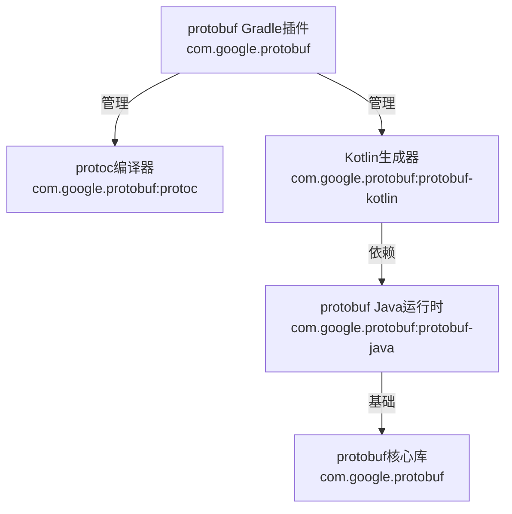
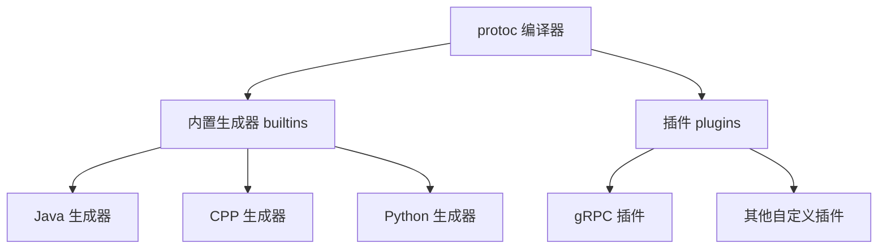

# Protobuf 工程实践

# proto 文件的命名标准

标准文件格式

- 行长度保持为 80 个字符。
- 使用 2 个空格的缩进。
- 对字符串使用双引号。

命名规范：文件名小写+下换线连接：`lower_snake_case.proto`

文件结构

1. 许可证头（如果有）
2. 文件概述
3. Syntax
4. Package
5. Imports
6. 文件选项
7. 数据结构

标识符命名规范

- 驼峰，只包含字母和数字
- 支持多种风格...
- 不要以下划线做首字母或结尾

包名：以点分割，全小写

Message 名：TitleCase，首字母大写的驼峰

字段名：snake_case，对重复字段使用复数名称：`string song_name = 1;`

枚举名：TitleCase，列出的第一个值应为零值枚举，并且后缀为 `_UNSPECIFIED` 或 `_UNKNOWN`。此值可用作未知/默认值 并且应该与您期望的任何语义值不同 显式设置

不允许在两个同级枚举中使用相同的名称

```protobuf
enum CollectionType {
  COLLECTION_TYPE_UNSPECIFIED = 0;
  SET = 1;
  MAP = 2;
}

enum TennisVictoryType {
  TENNIS_VICTORY_TYPE_UNSPECIFIED = 0;
  GAME = 1;
  SET = 2; // 与上面的 set 重名，建议前面加上枚举名称 Tennis_Victory_Type_SET
}
```

service：服务名称和方法名称使用 TitleCase

```protobuf
service FooService {
  rpc GetSomething(GetSomethingRequest) returns (GetSomethingResponse);
  rpc ListSomething(ListSomethingRequest) returns (ListSomethingResponse);
}
```

有关更多与服务相关的指南，请参阅 [为每个方法创建唯一的 Protos](https://protobuf.dev/best-practices/api#unique-protos) 和 [不要在顶级请求或响应 Proto 中包含原始类型](https://protobuf.dev/programming-guides/api#dont-include-primitive-types) 在 API 最佳实践主题中，以及 [在单独的文件中定义消息类型](https://protobuf.dev/best-practices/dos-donts#separate-files) 在 Proto 最佳实践中。

# protobuf 的 gradle 插件

## protobuf 依赖及其关系

- **com.google.protobuf:protobuf-kotlin**

  核心运行时库，提供基础 API，实现序列化/反序列化逻辑。包含跨语言支持的基础设施

- **com.google.protobuf:protoc**

  Protobuf 的编译器，调用语言特定的代码生成器，生成目标语言的数据结构

- id：**com.google.protobuf**

  protobuf 的 gradle 插件



## 简介

[Protobuf 插件](https://github.com/google/protobuf-gradle-plugin)做了两个事：

- 组织 Protobuf 编译器命令，生成 java 文件
- 将生成的 java 源文件添加到 java 的编译单元，一起编译
  - 注意，需要生成非 Java/Kotlin 源文件，它们不会自动包含在编译中，需要将它们添加到特定语言的源文件中。查看 [默认输出](https://github.com/google/protobuf-gradle-plugin#default-outputs)

## 添加插件到工程

```kotlin
// libs.versions.toml
[versions]
protobuf-plugin = "0.9.5"

[plugins]
# 编译项目的 protobuf，插件用 Gradle 插件 ID，而不是 Maven 坐标（是依赖管理使用）
protobuf-plugin = { id = "com.google.protobuf", version.ref = "protobuf-plugin" }

// build.gradle.kts
plugins {
    // 引入插件
    alias(libs.plugins.protobuf.plugin)
}
```

## 配置 protobuf 插件

Protobuf 插件假定 .proto 与 Java 源文件相同，均位于源集（sourceSets）中（如 main/test）。一个源集的所有 `.proto` 文件会被一次性编译，生成的 `java` 文件又作为该源集的 Java 编译任务的输入。该插件会为每个源集（`sourceSet`）新增名为 `proto` 的源码块（与 `java` 块同级），目录结构镜像：`src/main/java` ↔ `src/main/proto`。默认情况下，它会自动包含 `src/$sourceSetName/proto` 目录下的所有 `*.proto` 文件。

可按照配置 Java 源码的相同方式自定义此设置。

配置sourceSets的目的在于告诉插件proto文件的位置（引用外部协议库、需要排除特定文件）

```kotlin
sourceSets {
    main {  // 主源集
        proto {  // Protobuf 配置块
            // 下面三个 srcDir 会扫描到，然后一起编译
            // srcDir 'src/main/proto' // 默认目录
            srcDir 'src/main/protobuf'         // 添加目录1
            srcDir 'src/main/protocolbuffers'  // 添加目录2

            // 默认使用 .proto 后缀，不要使用它以外的扩展名，原因：系统仅能通过扩展名识别文件类型
            include '**/*.protodevel'          // 包含非标准扩展名文件，危险操作！
            // 排除实验性协议
            exclude 'experimental/**'
        }
        java {  // Java 源码块
            ...   // 标准 Java 配置
        }
    }

    test {   // 测试源集
        proto {
            // 在默认目录 'src/test/proto' 基础上添加
            srcDir 'src/test/protocolbuffers'  // 测试专用 Proto 目录
        }
    }
}
```

## 配置编译器

```kotlin
// 插件提供 protobuf 块，提供了所有的配置选项
protobuf {
    // 插件会查找系统中的 protoc 的可执行文件，建议直接从存储库下载
    // 插件会自动检测操作系统和架构，下载匹配的二进制文件
    // 配置 protobuf 编译器: protoc
    protoc {
        artifact = 'com.google.protobuf:protoc:3.0.0'
        // path = '/usr/local/bin/protoc' // 也可以指定本地目录，注意多个赋值则最后一个有效
    }
}
```

插件的 `plugins` 块也可以配置远程下载的工件或者本地目录：

```kotlin
protobuf {
  ...
  // 定位代码生成插件
  plugins {
    // 定位 grpc 代码生成插件
    // 如果项目中使用了 gRPC 服务定义（如 .proto 文件中包含 service 定义），但未配置 grpc 插件，构建时会报错
    // 如果 grpc 为空，proto 会使用当前目录中的可执行文件
    // 如果不指定工件 protoc 会使用系统搜索路径的 "protoc-gen-grpc"
    grpc {
      artifact = 'io.grpc:protoc-gen-grpc-java:1.0.0-pre2'
      // 或者
      // path = 'tools/protoc-gen-grpc-java'
    }
    // 其他插件
    ...
  }
  ...
}
```

Protobuf 插件为每个源集上运行的 protoc 生成一个任务。任务有配置的接口，允许去配置输出类型、代码生成插件的使用和一些参数。

必须配置这些任务在 `generateProtoTasks` 块中，该块会提供代码生成器方法访问这些任务。同时也确保你的配置会被插件正确的设置。

## 禁止事项

- 不要使用任务名，它们会改变
- 不要配置任务在  `generateProtoTasks` 块外，因为在配置任务的时候，会有细微的时间方面的限制

## 生成的任务

```kotlin
protobuf {
  ...
  generateProtoTasks {
    // all() 返回所有的 protoc 任务集合
    all().configureEach { task ->
      // 这里可以配置任务
    }

    // 除 all() 之外，还可以自行选择任务

    // (仅 Java) 返回源集的任务
    ofSourceSet('main')

    // (仅 Android 的选择器)返回特定任务
    ofFlavor('demo')
    // 根据构建类型返回任务（单一构建类型 (如 debug/release)）
    ofBuildType('release')
    // 根据构建变体返回任务（完整构建变体 (如 freeDebug/paidRelease)）
    ofVariant('demoRelease')
    // 返回非安卓测试的任务
    ofNonTest()
    // 返回安卓测试的任务
    ofTest()
  }
}
```

每个代码生成器任务有两个集合：

- `builtins`：`protoc` 中内置的代码生成器,如 `java`, `cpp`, `python`.
- `plugins`：和 `protoc` 一起工作的代码生成器插件，如 `grpc`。为了添加任务，它们必须定义在`protobuf.plugins` 块中。

## 配置生成的代码类型，和生成器的选项




每个内置的/插件的代码生成器生成指定类型的代码。在任务中添加或配置内置/插件代码生成器，使用大括号 `{}` 列出它们的名字。把配置选项放入大括号中：

```kotlin
task.builtins {
  // 在 protoc 最新版本中，这里的结果是在 protoc 命令行添加
  // "--java_out=/path/to/output --java_opt=example_option1=true,example_option2"
  // 使用 protoc 内置的 Java 生成器。生成 java 文件
  named("java") {
    option("example_option1=true")
    option("example_option2")
  }
  // 使用 protoc 内置的 c++ 生成器。生成 c++
  cpp { }
}

task.plugins {
  // 添加 grpc 的输出，但不包括任何选项。protobuf 插件的 plugins 块中必须定义了 grpc 插件
  // 这里的结果是在 protoc 命令行添加
  // "--grpc_out=/path/to/output"
  id("grpc") { }
}
```

## 默认代码生成器

java 工程中：内置的 java 代码生成器会默认添加，所以 build 时也会默认生成 class。不需要可以移除：

```kotlin

task.builtins {
    // 添加生成 python 的命令
    python { }
    // 移除生成 java 的 命令
    remove("java")
}
```

从 Protobuf 3.8.0 开始，lite code（轻量级代码）内置在 protoc 的 java 输出中，例如：

```kotlin
dependencies {
  // 需要依赖 lite 的运行时库，而不是 protobuf-java
  implementation 'com.google.protobuf:protobuf-javalite:3.8.0'
}

protobuf {
  protoc {
    artifact = 'com.google.protobuf:protoc:3.8.0'
  }
  generateProtoTasks {
    all().configureEach { task ->
      task.builtins {
        // 默认就有，所以通过 named 从 NamedDomainObjectContainer 获取出来，进行特殊配置 lite
        named("java") {
            option("lite")
        }
        // java 已经在插件自己的 NamedDomainObjectContainer 注册好了，kotlin 还没有
        // 所以，要配置 kotlin 代码生成器，需要添加
        create("kotlin") { } // 直接创建
        // 或
        register("kotlin") { } // 延迟注册，性能更优
      }
      task.plugins {
        // 不要在 {} 中添加东西，否则不会被添加。这是由于 NamedDomainObjectContainer 在绑定方法时的隐式机制所致
        id("grpc") { }
      }
    }
  }
}
```

- Protobuf 插件检测到 Java 插件（Kotlin 插件依赖  Java 插件）存在，会自动将生成的代码添加到源集（默认路径就在源集下 `src/main/proto`）。生成 proto 代码的任务会自动成为 `compileJava`/`compileKotlin` 的依赖，确保代码生成在编译前完成。
- 例如：python 就不会，生成的 Python 代码不会包含在编译中，需要手动添加到 Python 的编译任务中。

## 代码生成位置

每个内置/插件代码生成器都有一个子目录 `$builtinPluginName`，生成的文件位于 `task.outputBaseDir` 下。默认产生一个文件夹结构，为 `$buildDir/generated/sources/proto/$sourceSet/$builtinPluginName`。

可以在 `generateProtoTasks` 做任务配置的 `builtins/plugins` 块中配置输出位置

```kotlin
{ task ->
  task.plugins {
    grpc {
      // 使用 'grpcjava' 作为子目录名，而不是默认的 'grpc'
      outputSubDir = 'grpcjava'
    }
  }
}
```

## Proto 文件在依赖中

如果 Java 工程包含 proto 文件，proto 文件会和 class 一起被打包在 jar 中。

依赖项中的 proto（例如，上游 jar 文件）可以放在编译配置或 protobuf 配置中。

如果作为依赖项放入**编译配置中**，则 proto 文件将被提取到 extracted-include-protos 目录中，并添加到 protoc 命令行的 `--proto_path` 标志中，以便它们可以被当前项目的 `proto` 文件导入。导入的 `proto` 文件将不会被编译，因为它们已经在自己的项目中编译过了。示例：

```kotlin
dependencies {
  implementation project(':someProjectWithProtos')
  testImplementation files("lib/some-testlib-with-protos.jar")
}
```

如果作为依赖项放入 **`protobuf` 配置中**，`proto` 文件将被提取到 `extracted-protos` 目录，并作为编译文件添加到 `protoc` 命令行中，与当前项目的 `proto` 文件（如果有）一起通过 `protoc` 编译。示例：

```kotlin
dependencies {
  // proto 文件可以来自本地的包
  protobuf files('lib/protos.tar.gz')
  // 来自本地目录,
  protobuf files('ext/')   // 不要使用 fileTree(). 看 issue #248.
  // 来自存储库中的工件
  testProtobuf 'com.example:published-protos:1.0.0'
}
```

这个 [Maven Central 目录](https://repo1.maven.org/maven2/com/google/protobuf/protoc/)列出了可以被此插件使用的预编译 protoc 工件。

## idea 设置

确保将 IDE `build/run` 操作委托给 `Gradle`，这样 IntelliJ 就不会使用其内部构建机制来编译源代码。此插件确保代码生成发生在 Gradle 构建步骤之前。如果此设置关闭，将使用 IntelliJ 自己的构建系统而不是 Gradle。

启用设置：

```bash
Settings -> Build, Execution, Deployment
  -> Build Tools -> Gradle -> Runner
  -> Delegate IDE build/run actions to gradle.
```

此插件与 IDEA 插件集成，并自动将 proto 文件和生成的 Java 代码注册为源文件。

## 参考

[kotlin 代码生成器](https://github.com/protocolbuffers/protobuf/blob/main/src/google/protobuf/compiler/kotlin/README.md)

[kotlin DSL 项目示例](https://github.com/google/protobuf-gradle-plugin/tree/master/examples/exampleKotlinDslProject)


# 工程实践


## 参考文档

- [Language Guide ](https://protobuf.dev/programming-guides/proto3/)（v3.21+语法）
- [Encoding ](https://protobuf.dev/programming-guides/encoding/)（二进制序列化原理）
- [Best Practices ](https://protobuf.dev/programming-guides/style/?spm=a2ty_o01.29997173.0.0.4c39c921uSCLap)（命名规范与设计模式）
- [Protobuf Plugin for Gradle](https://plugins.gradle.org/plugin/com.google.protobuf)（Google 官方维护的 Gradle 插件）
- [Java 指南](https://protobuf.dev/reference/java/)
- [Kotlin 指南](https://protobuf.dev/reference/kotlin/)